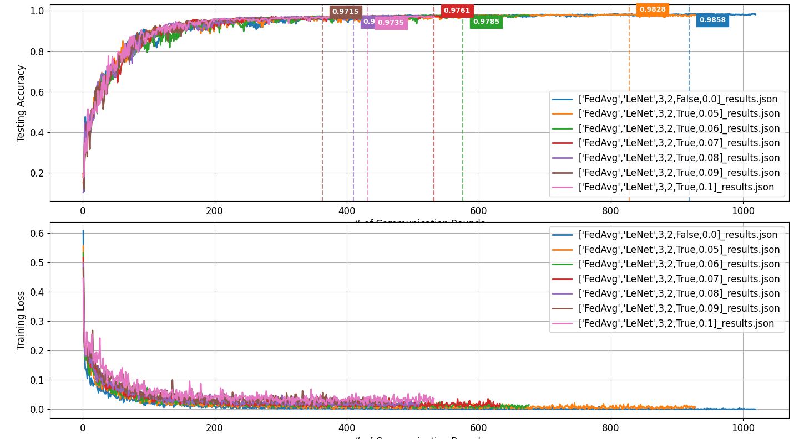

[English](README.md) | [简体中文](README.zh-CN.md)
# Combination of Federated Learning and Laplace Mechanism-based Differential Privacy Technology

**Project Description：** This project is a fork of [rruisong/pytorch_federated_learning](https://github.com/rruisong/pytorch_federated_learning). I would like to express my gratitude to the original author for his basic work.

## ✨ Core Features

Compared with the parent project, this project implements privacy protection based on the Laplace mechanism and makes a series of architectural optimizations:
- **Support for Local Differential Privacy (LDP)**: The LDP mechanism is integrated, and gradient clipping and Laplacian noise can be added by configuration to study federated learning under privacy protection.

- **Efficient parallel simulation**: The client's **parallel training** is implemented using `concurrent.futures`, which can make full use of multi-core CPU resources and significantly shorten the simulation time.

- **Early Termination**: Supports the Early Stopping mechanism, which automatically stops training when the model performance no longer improves within the set patience value, saving computing resources.

- **Breakpoint Resume**: It can automatically save and load training checkpoints (`checkpoint`), making it easy to resume long experiments from interruptions.
- **Elegant architecture design**: The client architecture was reconstructed using the "template method" design pattern, eliminating the redundancy of repeatedly writing training loops in each algorithm, significantly improving the maintainability and scalability of the code.

## ⚙️ Project structure

```text
├── config/                   # Storage of configuration files
│   └── test_config.yaml      # Main experimental configuration files
├── fed_baselines/            # Core algorithm implementation
│   ├── client_base.py        # Client base class (implementation of FedAvg)
│   ├── client_fedprox.py     # FedProx algorithm client
│   ├── client_scaffold.py    # SCAFFOLD algorithm client
│   ├── client_fednova.py     # FedNova client
│   ├── server_base.py        # Server base class (implementation of FedAvg)
│   ├── server_scaffold.py    # SCAFFOLD algorithm server
│   └── server_fednova.py     # FedNova algorithm server
├── figures/                  # Storage of generated charts
├── postprocessing/           # Result post-processing
│   ├── eval_main.py          # Main program for result evaluation and visualization
│   └── recorder.py           # Result recording and drawing tool class
├── preprocessing/            # Data preprocessing
│   └── baselines_dataloader.py # Data loading and Non-IID partitioning
├── utils/                    # Auxiliary tools
│   ├── models.py             # Neural network model definition
│   └── fed_utils.py          # Federated learning auxiliary function
├── fl_main.py                # Federated learning main training program
└── requirements.txt          # Python dependency package list
```

## 🚀 Quick Start

### 1. Environment preparation

It is recommended to use a virtual environment (such as `conda` or `venv`) to manage project dependencies.

```bash
# Clone the repository
git clone https://github.com/zpx2022/pytorch_federated_learning_differential_privacy.git
cd pytorch_federated_learning_differential_privacy

# (Optional, recommended) Create and activate the conda virtual environment
conda create -n fldp python=3.8
conda activate fldp

# Install dependencies
pip install -r requirements.txt
```

### 2. Configure the experiment
Open the test_config.yaml file and modify the experimental parameters according to your needs.

### 3. Run training
Execute the main program fl_main.py to start training. All results and checkpoints will be saved in the results/ and checkpoints/ directories by default.
```bash
python fl_main.py --config test_config.yaml
```

### 4. Evaluate and visualize results
Draw all .json result files in the results/ directory into a graph
```bash
python eval_main.py --sys-res_root results
```

## 📈 Experimental results and analysis



I conducted experiments on the highly non-IID MNIST dataset (each client only has 2 categories of data) to evaluate the impact of different intensities of Laplace noise (`laplace_noise_scale` from `0.0` to `0.1`) on the performance of the FedAvg algorithm.


The basis for selecting Laplace noise intensity: MNist is a handwritten dataset with 10 categories (0-9), which is low-sensitivity data. We can adopt a utility-first strategy, that is, the `max acc` loss is required to be less than `0.01`, and the privacy budget per round is `>=10`. According to the formula of privacy budget per round = `sensitivity`/`noise intensity` (sensitivity is similar to the value of the hyperparameter `grad_clip_norm`, which is `1.0`), the noise intensity should be `<=0.1`. To narrow the range, the privacy budget is set to `<=20`. At this time, the noise intensity range is `[0.05,0.1]`, and `0.05`, `0.06`, `0.07`, `0.08`, `0.09`, `0.1` are selected.

### 1\. Comparison of test accuracy

The first sub-figure shows how the test accuracy of the global model changes with the number of communication rounds under different noise intensities. From the accuracy curve, we can clearly observe the following points:

* **Privacy-utility trade-off**: The overall trend shows that as the noise intensity increases, the final convergence performance (maximum accuracy) of the model will decrease. This intuitively demonstrates the classic "privacy-utility trade-off" in differential privacy - in order to enhance privacy protection, part of the model's performance needs to be sacrificed. Based on the utility-first strategy, the `max acc` loss of experiments with noise intensities of `0.05`, `0.06`, `0.07` and `0.08` is less than `0.01`, which can all be used as effective local differential privacy parameter settings.

* **Convergence speed**: In general, the larger the noise intensity of the experiment, the smaller the rounds corresponding to the model reaching the final convergence performance (maximum accuracy), that is, **the faster it reaches the performance bottleneck**.

### 2\. Training loss comparison

The second sub-figure shows the impact of different noise intensities on the average training loss of the global model. The trend of the loss curve is consistent with the accuracy curve:

* **Fitting difficulty**: The higher the noise intensity, the higher the training loss, indicating that the injected noise increases the difficulty of the model fitting local data and affects the learning process.

* **Stability**: The loss curve of the low noise (such as `0.0`, `0.05`) experiment drops more smoothly, while the curve of the high noise experiment shows more violent fluctuations.

## 📈 Experimental Results and Analysis
I conducted a series of experiments on the highly non-IID MNIST dataset (each client has only 2 categories of data) to evaluate and compare the performance of three federated learning algorithms, FedAvg, FedProx, and FedNova, when combined with local differential privacy (LDP). The experiment simulated different levels of privacy protection by introducing different intensities of Laplace noise (laplace_noise_scale from 0.0 to 0.1).

#### Basis for selecting Laplace noise intensity
The basis for selecting noise intensity follows the **Utility-First** strategy, and the specific steps are as follows:

- Basic strategy and goal:

  Considering that MNIST is a public dataset with low sensitivity, we prioritize the availability of the model. Therefore, our preset utility goal is: after introducing LDP noise, the       maximum accuracy loss of the model should not exceed 0.01.

- Privacy budget range:

  In order to explore the impact of privacy protection while ensuring high availability, we set a relatively loose single-round privacy budget range ε ∈ [10, 20].

- Theoretical formula:

  According to the definition of the Laplace mechanism in differential privacy, the relationship between the privacy budget ε and the noise intensity λ is:

$$
\epsilon = \frac{\Delta s}{\lambda}
$$

- Parameter definition:

  - ε: Single-round privacy budget.

  - Δs: Sensitivity. In this scenario, we use gradient clipping, so the sensitivity is defined by the clipping norm `grad_clip_norm`, whose value is `1.0`.

  - λ: The strength of Laplace noise (Noise strength), corresponding to the hyperparameter `laplace_noise_scale`.

- Derivation and selection:

  Based on the above formulas and parameters, we can derive the range of noise intensity:

  - When **ε ≥ 10**, we can get **λ ≤ 1.0 / 10 = 0.1**.

  - When **ε ≤ 20**, we can get **λ ≥ 1.0 / 20 = 0.05**.

  Finally, we set the exploration range of noise intensity **λ** to the **`[0.05, 0.1]`** interval and evenly take values for experiments to observe in detail the trend of model             performance changing with privacy budget.  

### 1\. Overview of core performance indicators

The following table summarizes the maximum accuracy (Max Accuracy) of the three algorithms at different noise intensities and the number of communication rounds (Round) required to achieve this accuracy.

| Algorithm | 0.0 | 0.05 | 0.06 | 0.07 | 0.08 | 0.09 | 0.1 |
| :--- | :--- | :--- | :--- | :--- | :--- | :--- | :--- |
| **FedAvg** | 0.9858 (919 rounds) | 0.9828 (828 rounds) | 0.9785 (576 rounds) | 0.9761 (532 rounds) | 0.9785 (576 rounds) | 0.9715 (363 rounds) | 0.9735 (432 rounds) |
| **FedProx** | 0.9821 (661 rounds) | 0.9790 (590 rounds) | 0.9816 (732 rounds) | 0.9764 (621 rounds) | 0.9744 (608 rounds) | 0.9712 (494 rounds) | 0.9643 (341 rounds) |
| **FedNova** | 0.9881 (1166 rounds) | 0.9828 (775 rounds) | 0.9795 (603 rounds) | 0.9674 (255 rounds) | 0.9779 (617 rounds) | 0.9714 (423 rounds) | 0.9723 (548 rounds) |

### 2\. Algorithm performance curve comparison

The following three figures show the test accuracy and training loss change curves of `FedAvg`, `FedProx` and `FedNova` under different noise levels.

#### FedAvg performance curve

#### FedProx performance curve

#### FedNova performance curve

### 3\. Comprehensive analysis and conclusion

1. **Baseline performance (without LDP)**: In the non-IID environment without adding noise, `FedNova` performs best with an accuracy of **98.81%**, proving its superiority in solving the problem of data heterogeneity. `FedAvg` (`98.58%`) and `FedProx` (`98.21%`) also perform well, among which `FedProx` converges the fastest.

2. **Performance comparison under LDP environment**: When local differential privacy noise is introduced, all algorithms show the classic "**privacy-utility trade-off**", that is, higher  privacy protection (greater noise) will lead to degraded model performance. However, the three algorithms show significant differences in **robustness** to noise:

  * **`FedAvg` is the most robust**: Although the algorithm is the simplest, `FedAvg` is the most resistant to noise. Its performance decays most smoothly and predictably with the           increase of noise, and it still maintains a high accuracy of `97.35%` under high noise (`0.1`).   
  * **`FedProx` is more sensitive to noise**: `FedProx` has the most significant performance degradation after the introduction of noise, and its accuracy drops to `96.43%` when             `Noise=0.1`. This may be because its proximal term, which is intended to constrain local updates, "conflicts" with the random noise injected by LDP, which in turn exacerbates the instability of training.   
* **`FedNova` performs the most unstable**: Although `FedNova` has the strongest benchmark performance, its results fluctuate greatly in the LDP environment. Its core normalization mechanism may be seriously disturbed by noise, causing its aggregation strategy to be sometimes effective and sometimes ineffective, and the training process is difficult to stabilize.

3. **Final conclusion**: This series of experiments shows that when designing privacy protection mechanisms for federated learning systems, **federated learning algorithms and privacy technologies cannot be viewed in isolation**.

  Although `FedProx` and `FedNova` have theoretical advantages in processing non-IID data and have been verified in benchmark tests, the most basic **`FedAvg` algorithm showed the best      "privacy-utility" balance in this experiment**. Its simple aggregation strategy is more robust in the face of random noise, and its performance decay is more gradual.

  Therefore, for applications that require local differential privacy in a highly non-IID environment, FedAvg may be a more reliable baseline choice due to its simplicity and robustness     to noise. This provides important insights for future research on how to design federated learning algorithms that are more compatible with differential privacy.
