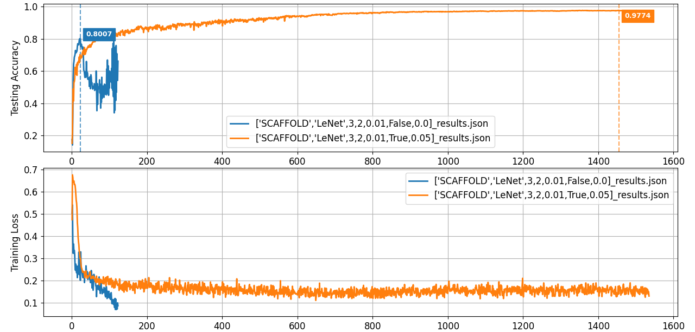

[English](README.md) | [简体中文](README.zh-CN.md)
## 1. Project Overview
This project is a deeply optimized fork of [rruisong/pytorch_federated_learning](https://github.com/rruisong/pytorch_federated_learning).
The original project provides a basic simulation platform for federated learning algorithms. Building upon this foundation, this project undergoes a comprehensive **architecture refactoring and functional enhancements**, aiming to address the core issues of the original code in **code redundancy, scalability, experimental efficiency, and robustness**.

In addition, this project integrates a **gradient perturbation module** based on the Laplace mechanism. This module improves training stability and provides a certain degree of heuristic privacy protection by clipping and adding noise to the aggregated batch average gradients. **While this manipulation of the batch average gradient does not meet the strict definition of differential privacy (it cannot quantify the privacy budget), by limiting the overall norm of a single update and injecting noise, it intuitively adheres to the principle of "greater noise, stronger privacy protection." **Based on this, we conducted systematic performance comparison experiments on four classic federated learning algorithms: FedAvg, FedProx, FedNova, and SCAFFOLD, in a highly non-IID (non-IID) environment.

## 2. Core Optimizations and Contributions

### 2.1 Architecture Refactoring: Improving Code Reusability and Extensibility Using Template Methods and Hook Functions

* **Issue**: In the original project, the clients of various algorithms (e.g., `FedProx` and `SCAFFOLD`) independently implemented the complete training process, resulting in extensive code duplication and difficulty in maintenance.

* **My Implementation**: I refactored the client base class `client_base.py` to abstract the common training processes (such as data loading, forward propagation, gradient calculation, and parameter update) into the `train()` **template method**. The unique logic of each algorithm (such as the proximal term in FedProx and the gradient correction in SCAFFOLD) is injected through rewritable **hooks** (e.g., `_calculate_custom_loss`), greatly improving code reusability and scalability.

### 2.2 Experimental Process Optimization: Improving Efficiency, Robustness, and Effectiveness

* **Parallel Training (Efficiency)**: Utilizing Python's `concurrent.futures.ProcessPoolExecutor` to parallelize client-side local training, significantly reducing the time required to run simulation experiments on multi-core CPUs.

* **Checkpointing (Robustness)**: Implemented automatic saving and loading of checkpoints. For long-running experiments, even if unexpectedly interrupted, they can be resumed from the last completed epoch, preventing data loss.

* **Early Stopping (Effectiveness)**: Introduced an early stopping feature. If the model's performance stops improving within a preset "patience round" period, training will automatically terminate to conserve computing resources and prevent overfitting.

## 3. Experimental Conclusions and Basis

Experimental Environment Setup: MNIST dataset, LeNet model, 100 clients, non-IID (two classes per client).

#### FedAvg


* **Conclusion**: Noise intensity is negatively correlated with overall model performance, and greater noise levels lead to fewer rounds required for the model to converge to a performance bottleneck.

* **Basis**: As shown in the figure above, the baseline experiment without gradient perturbation achieved a top-of-the-line accuracy of 98.58%. As the noise level increases, the model's top-of-the-line accuracy decreases. At the same time, the speed of reaching peak performance is significantly accelerated: for example, the unperturbed baseline experiment reached its peak performance (98.58%) at epoch 986, while the experiment with a noise scale of 0.05 reached its peak performance (98.28%) at epoch 830, and the experiment with the strongest noise scale (0.1) reached its performance bottleneck even earlier, at epoch 703 (97.35%).

#### FedNova


* **Conclusion**: FedNova performs best under noise-free conditions.

* **Justification**: Under noise-free conditions, the algorithm achieves the highest MAX ACC of all algorithms, at 98.81%. This is primarily due to its consideration of differences in the number of local training steps and data distribution between clients, which can lead to unfair weighting during aggregation.

#### FedProx


* **Conclusion**: FedProx demonstrates the strongest robustness in the presence of noise.

* **Justification**: Its average relative performance loss in the presence of noise is the lowest of all algorithms, at only 0.78%. This indicates that its performance is least affected by gradient perturbations.

#### SCAFFOLD




* **Conclusion**: SCAFFOLD is sensitive to learning rate and has a regularizing effect in the presence of noise when training is unstable.

**Reason**: When the learning rate is set to 0.01, noise-free training crashes, achieving a maximum accuracy of only 80.07%. However, after adding noise, training converges stably, reaching a maximum accuracy of 97.74%. Suspecting that this is sensitive to the learning rate, we lowered the learning rate to 0.005, at which point noise-free training converges stably, reaching a maximum accuracy of 96.96%.

## 4. How to Run

### 4.1 Environment Configuration

This project is based on Python 3.8+ and PyTorch 1.10+. Please use pip to install all dependencies:

```bash

pip install -r requirements.txt

````

### 4.2 Running Experiments

All experiments are driven by the configuration file `test_config.yaml`. You can modify this file to configure different algorithms, models, datasets, and hyperparameters.

```yaml

client:

fed_algo: "SCAFFOLD" # Optional: FedAvg, FedProx, SCAFFOLD, FedNova

lr: 0.005

use_gradient_perturbation: True # Enable gradient perturbation

laplace_noise_scale: 0.05 # Noise scale

```

Start training with the following command:

```bash

python fl_main.py --config test_config.yaml

```

Experiment results (JSON files) and checkpoints (.pth files) are saved in the `results/` and `checkpoints/` directories by default.

### 4.3 Evaluation and Plotting

The `eval_main.py` script can be used to visualize the results of one or more experiments saved in the `results/` folder.

```bash

python eval_main.py -rr results

```

## 5\. Acknowledgements

This project's code is based on the excellent work of [rruisong/pytorch_federated_learning](https://github.com/rruisong/pytorch_federated_learning). We would like to express our sincere gratitude to the original author for their open source contribution.
