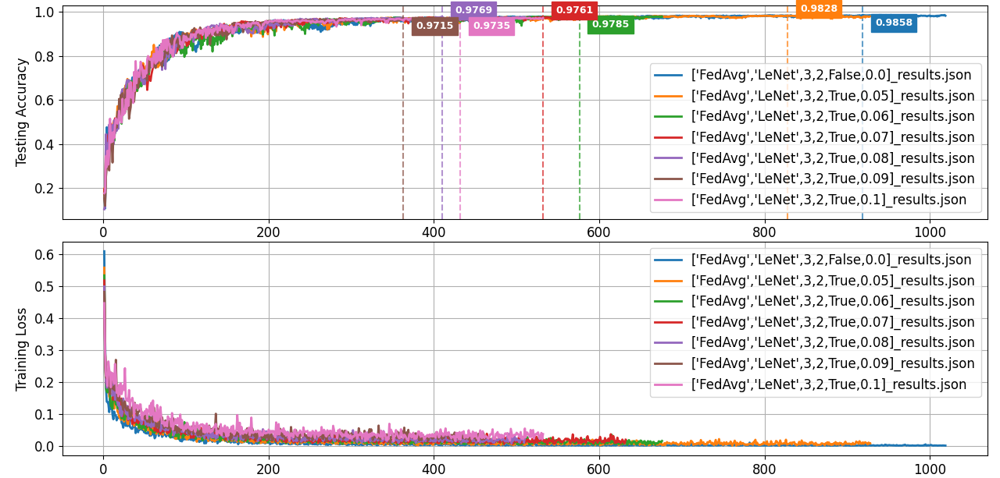
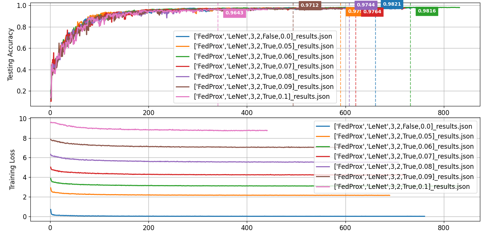

[English](README.md) | [简体中文](README.zh-CN.md)
# 联邦学习和基于拉普拉斯机制的差分隐私技术的结合

**项目说明：** 本项目是 [rruisong/pytorch_federated_learning](https://github.com/rruisong/pytorch_federated_learning) 的一个分支，本人对原作者的基础性工作表示感谢。

## ✨ 核心特性

相较于父项目，本项目实现了基于拉普拉斯机制的隐私保护，做出了一系列的架构优化：
- **支持本地差分隐私 (LDP)**: 集成了 LDP 机制，可通过配置开启梯度裁剪 (Gradient Clipping) 和拉普拉斯噪声 (Laplacian Noise) 添加，用于研究隐私保护下的联邦学习。

- **高效的并行模拟**: 利用 `concurrent.futures` 实现了客户端的**并行训练**，可充分利用多核 CPU 资源，显著缩短模拟所需时间。

- **提前终止**: 支持提前终止 (Early Stopping) 机制，当模型性能在设定的耐心值内不再提升时自动停止训练，节约计算资源。

- **断点续传**: 能够自动保存和加载训练检查点 (`checkpoint`)，方便从中断处恢复长时间的实验。
  
- **优雅的架构设计**: 采用“模板方法”设计模式重构了客户端架构，消除了在每个算法中重复编写训练循环的冗余问题，显著提升了代码的可维护性与扩展性。

## ⚙️ 项目结构

```text
├── config/                    # 存放配置文件
│   └── test_config.yaml       # 主要实验配置文件
├── fed_baselines/             # 核心算法实现
│   ├── client_base.py         # 客户端基类 (实现 FedAvg)
│   ├── client_fedprox.py      # FedProx 算法客户端
│   ├── client_scaffold.py     # SCAFFOLD 算法客户端
│   ├── client_fednova.py      # FedNova 算法客户端
│   ├── server_base.py         # 服务器基类 (实现 FedAvg)
│   ├── server_scaffold.py     # SCAFFOLD 算法服务器
│   └── server_fednova.py      # FedNova 算法服务器
├── figures/                   # 存放生成的图表
├── postprocessing/            # 结果后处理
│   ├── eval_main.py           # 结果评估与可视化主程序
│   └── recorder.py            # 结果记录与绘图工具类
├── preprocessing/             # 数据预处理
│   └── baselines_dataloader.py# 数据加载与 Non-IID 划分
├── utils/                     # 辅助工具
│   ├── models.py              # 神经网络模型定义
│   └── fed_utils.py           # 联邦学习辅助函数
├── fl_main.py                 # 联邦学习主训练程序
└── requirements.txt           # Python 依赖包列表
```

## 🚀 快速开始

### 1. 环境准备

建议使用虚拟环境（如 `conda` 或 `venv`）来管理项目依赖。

```bash
# 克隆仓库
git clone https://github.com/zpx2022/pytorch_federated_learning_differential_privacy.git
cd pytorch_federated_learning_differential_privacy

# (可选，推荐) 创建并激活 conda 虚拟环境
conda create -n fldp python=3.8
conda activate fldp

# 安装依赖
pip install -r requirements.txt
```

### 2.配置实验
打开 test_config.yaml 文件，根据您的需求修改实验参数。

### 3.运行训练
执行主程序 fl_main.py 开始训练。所有结果和检查点将默认保存在 results/ 和 checkpoints/ 目录下。
```bash
python fl_main.py --config test_config.yaml
```

### 4.评估与可视化结果
训练结束后，使用 eval_main.py 来绘制性能曲线图。
```bash
# 将 results/ 目录下的所有 .json 结果文件绘制成图
python eval_main.py --sys-res_root results
```

## 📈 实验结果与分析
本人在高度 Non-IID 的 MNIST 数据集上（每个客户端仅拥有2个类别的数据）进行了系列实验，旨在评估和对比 FedAvg, FedProx, FedNova 三种联邦学习算法在与本地差分隐私（LDP）结合时的性能表现。实验通过引入不同强度的拉普拉斯噪声（laplace_noise_scale 从 0.0 到 0.1）来模拟不同级别的隐私保护。

#### 拉普拉斯噪声强度的选择依据
我们选择噪声强度的依据，遵循了**效用优先（Utility-First）**的策略，具体步骤如下：

- 基本策略与目标：

  考虑到 MNIST 是一个敏感度较低的公开数据集，我们优先保证模型的可用性。因此，我们预设的效用目标是：在引入LDP噪声后，模型的最高准确率（Max Accuracy）损失不应超过 0.01。

- 隐私预算范围：

  为了在保证较高可用性的前提下探索隐私保护的影响，我们设定了一个相对宽松的单轮隐私预算范围 ε ∈ [10, 20]。

- 理论公式：

  根据差分隐私中拉普拉斯机制的定义，隐私预算 ε 与噪声强度 λ 的关系为：

$$
\epsilon = \frac{\Delta s}{\lambda}
$$


- 参数定义:

  - **ε**：单轮隐私预算 (Single-round privacy budget)。
  - **Δs**：敏感度 (Sensitivity)。在此场景下，我们使用梯度裁剪，因此敏感度由裁剪范数 `grad_clip_norm` 定义，其值为 `1.0`。
  - **λ**：拉普拉斯噪声的强度 (Noise strength)，对应于超参数 `laplace_noise_scale`。

- 推导与选择：

  根据上述公式和参数，我们可以推导出噪声强度的范围：

  - 当 **ε ≥ 10** 时，可得 **λ ≤ 1.0 / 10 = 0.1**。
  - 当 **ε ≤ 20** 时，可得 **λ ≥ 1.0 / 20 = 0.05**。

  最终，我们将噪声强度 **λ** 的探索范围设定在 **`[0.05, 0.1]`** 区间，并均匀取值进行实验，以详细观察模型性能随隐私预算变化的趋势。
  
### 1\. 核心性能指标总览

下表汇总了三种算法在不同噪声强度下的最高准确率（Max Accuracy）以及达到该准确率所需的通信轮次（Round）。
| 算法 | 0.0 | 0.05 | 0.06 | 0.07 | 0.08 | 0.09 | 0.1 |
| :--- | :--- | :--- | :--- | :--- | :--- | :--- | :--- |
| **FedAvg** | 0.9858 (919轮) | 0.9828 (828轮) | 0.9785 (576轮) | 0.9761 (532轮) | 0.9785 (576轮) | 0.9715 (363轮) | 0.9735 (432轮) |
| **FedProx** | 0.9821 (661轮) | 0.9790 (590轮) | 0.9816 (732轮) | 0.9764 (621轮) | 0.9744 (608轮) | 0.9712 (494轮) | 0.9643 (341轮) |
| **FedNova** | 0.9881 (1166轮)| 0.9828 (775轮) | 0.9795 (603轮) | 0.9674 (255轮) | 0.9779 (617轮) | 0.9714 (423轮) | 0.9723 (548轮) |


### 2\. 算法性能曲线对比

以下三张图分别展示了 `FedAvg`、`FedProx` 和 `FedNova` 在不同噪声水平下的测试准确率和训练损失变化曲线。

#### FedAvg 性能曲线

#### FedProx 性能曲线

#### FedNova 性能曲线

### 3\. 综合分析与结论

1.  **基准性能 (无 LDP)**：在不添加噪声的 Non-IID 环境下，`FedNova` 表现最佳，准确率达到 **98.81%**，证明了其在解决数据异构性问题上的优越性。`FedAvg` (`98.58%`) 和 `FedProx` (`98.21%`) 同样表现出色，其中 `FedProx` 的收敛速度最快。

2.  **LDP 环境下的性能对比**：当引入本地差分隐私噪声后，所有算法都展现了经典的“**隐私-效用权衡**”，即更高的隐私保护（更大的噪声）会导致模型性能下降。但三种算法对噪声的**鲁棒性**表现出显著差异：

      * **`FedAvg` 表现最稳健**：尽管算法最简单，但 `FedAvg` 对噪声的抵抗能力最强。其性能随噪声增加的衰减最为平缓和可预测，在高噪声 (`0.1`) 下依然保持了 `97.35%` 的高准确率。
      * **`FedProx` 对噪声较为敏感**：`FedProx` 在引入噪声后性能下降最为显著，在 `Noise=0.1` 时准确率降至 `96.43%`。这可能是因为其旨在约束本地更新的近端项与LDP注入的随机噪声产生了“冲突”，反而加剧了训练的不稳定性。
      * **`FedNova` 表现最不稳定**：虽然 `FedNova` 的基准性能最强，但在LDP环境下其结果波动极大。其核心的归一化机制可能受到了噪声的严重干扰，导致其聚合策略时而有效、时而失效，训练过程难以稳定。

3.  **最终结论**：本次系列实验表明，在为联邦学习系统设计隐私保护机制时，**不能孤立地看待联邦学习算法和隐私技术**。

    虽然 `FedProx` 和 `FedNova` 在处理 Non-IID 数据方面具有理论优势，并也在基准测试中得到了验证，但最基础的 **`FedAvg` 算法在本次实验中展现出了最佳的“隐私-效用”均衡性**。其简洁的聚合策略在面对随机噪声时反而更具鲁棒性，性能衰减也更为平缓。

    因此，对于需要在高度 Non-IID 环境下部署本地差分隐私的应用，`FedAvg` 凭借其简洁性和对噪声的鲁棒性，可能是一个更可靠的基线选择。这为未来研究如何设计与差分隐私更兼容的联邦学习算法提供了重要启示。

### 4\. 深入案例分析：SCAFFOLD的训练不稳定性与噪声正则化效应

在对 `SCAFFOLD` 算法的初步实验中，我们观察到了一个反常的现象：在学习率设置为 `0.01` 时，无噪声的基准实验因训练过程极不稳定，在第123轮便早早停止，最高准确率仅为 **80.07%**。然而，加入了LDP噪声（强度0.05）的对照组，其训练过程却非常稳定，并最终达到了 **97.74%** 的高准确率]。**这一“加噪声性能反而更好”的结果违背了差分隐私的常规认知。**

本人据此提出假设：**`SCAFFOLD` 算法在高度Non-IID环境下对学习率高度敏感，而LDP噪声在不稳定的训练中可能起到了意想不到的正则化（Regularization）效果。**

为了验证该假设，我们设计了补充实验，将学习率降低为 `0.005` 并重新运行。实验结果完美地证实了我们的猜想：

  * **稳定的新基准**：在 `lr=0.005` 时，无噪声的基准实验变得非常稳定，并成功收敛至 **96.96%** 的最高准确率。
  * **真实的权衡**：在这个稳定基线上，加入了LDP噪声（强度0.05）的版本准确率则为 **96.12%**。

**最终洞察**：该案例深刻地揭示了，在特定场景下，差分隐私噪声可以起到稳定训练的作用。同时，也证明了在进行算法对比时，为每个算法寻找到合适的超参数以建立一个“公平”的基线是至关重要的。
