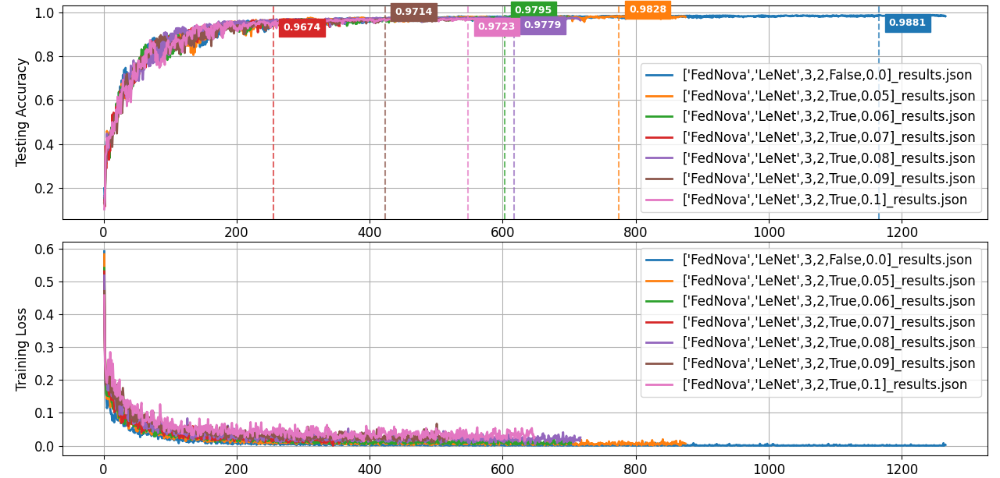
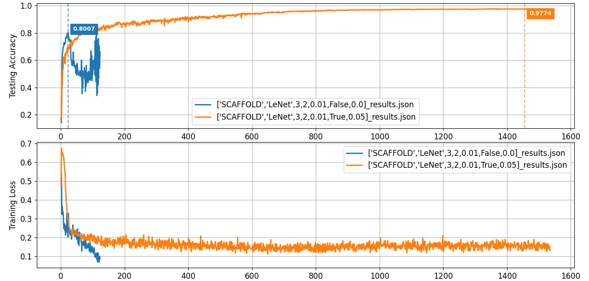
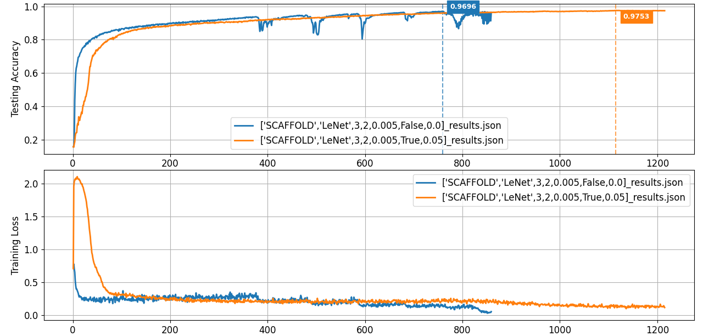

## 1. 项目概述
本项目是 [rruisong/pytorch_federated_learning](https://github.com/rruisong/pytorch_federated_learning) 的一个深度优化分支。
原始项目为联邦学习算法提供了一个基础的模拟平台。在此基础上，本项目进行了一次全面的**架构重构和功能增强**，旨在解决原始代码在**代码冗余、可扩展性、实验效率和健壮性**方面的核心问题。

此外，本项目还集成了基于拉普拉斯机制的**梯度扰动模块**。该模块通过对聚合后的批次平均梯度进行裁剪与加噪，实现了训练稳定性提升，并提供一定的启发式隐私保护。**虽然这种对批次平均梯度进行操作的方式不满足严格的差分隐私定义（无法量化隐私预算），但通过限制单次更新的整体范数并注入噪声，直观上仍然遵循‘噪声越大，隐私保护越强’的原则。**在此基础上，于高度非独立同分布（Non-IID）的环境下，对 FedAvg、FedProx、FedNova、SCAFFOLD 四种经典联邦学习算法进行了系统的性能对比实验。

## 2. 核心优化与贡献


### 2.1 架构重构：利用模板方法与钩子函数提升代码复用性与扩展性

* **问题**: 原始项目中，多种算法的客户端 (`FedProx`, `SCAFFOLD` 等) 均独立实现了完整的训练流程，导致了大量代码重复且难以维护。

* **我的实现**: 重构了客户端基类 `client_base.py`，将通用的训练流程（如数据加载、前向传播、梯度计算、参数更新）抽象为 `train()` **模板方法**。而各算法的独特逻辑（如FedProx的近端项、SCAFFOLD的梯度修正）则通过可重写的**钩子函数**（Hooks, e.g., `_calculate_custom_loss`) 注入，极大地提升了代码的复用性和可扩展性。


### 2.2 实验流程优化：提升效率、健壮性与有效性

* **并行训练 (效率)**: 利用 Python 的 `concurrent.futures.ProcessPoolExecutor` 将客户端的本地训练并行化，显著缩短了在多核CPU上运行模拟实验所需的时间。

* **检查点机制 (健壮性)**: 实现了检查点（Checkpoint）的自动保存与加载。对于长时间运行的实验，即使意外中断，也可以从上一个完成的轮次恢复，避免了数据丢失。

* **早停机制 (有效性)**: 引入了早停（Early Stopping）功能。当模型的性能在预设的“耐心轮次”内不再提升时，训练将自动终止，以节省计算资源并防止过拟合。


## 3. 实验结论与依据


实验环境设置：MNIST 数据集, LeNet 模型, 100个客户端, non-IID (每个客户端2个类别)。


#### FedAvg


* **结论**: 噪声强度与模型性能整体呈负相关，且噪声越大，模型收敛至性能瓶颈所需轮次越少。

* **依据**: 如上图所示，无梯度扰动的基准实验达到了最高的**98.58%**准确率。随着噪声规模的增加，模型的最高准确率逐步下降。同时，达到性能峰值的速度也显著加快：例如，无扰动的基准实验在第 986 轮才达到其性能峰值（98.58%），而噪声规模为 0.05 的实验在第 830 轮达到峰值（98.28%），噪声最强的（0.1）实验则在更早的 703 轮就达到了其性能瓶颈（97.35%）。


#### FedNova



* **结论**: FedNova在无噪声条件下性能最佳。

* **依据**:在无噪声条件下该算法的MAX ACC在所有算法中最高，为98.81%。这主要归功于其考虑到客户端之间本地训练步数和数据分布的差异，会导致聚合时的权重不公平。


#### FedProx


* **结论**: FedProx在有噪声条件下表现出最强的鲁棒性。

* **依据**: 在有噪声条件下该算法的平均相对性能损失在所有算法中最低，仅为0.78%。这表明其性能受梯度扰动的影响最小。


#### SCAFFOLD






* **结论**: SCAFFOLD对学习率较敏感，在训练不稳定的情况下噪声具有正则化效果。

* **依据**: 当学习率设为0.01，无噪声的训练会崩溃，最大准确率仅为80.07%；加入噪声后，训练反而稳定收敛，最大准确率达到了97.74%。猜想其对学习率敏感，于是将学习率降为0.005，此时无噪声训练稳定收敛，最大准确率达到了96.96%。


## 4. 如何运行


### 4.1 环境配置

本项目基于 Python 3.8+ 和 PyTorch 1.10+。请使用pip安装所有依赖：

```bash

pip install -r requirements.txt

````


### 4.2 运行实验


所有实验均通过配置文件 `test_config.yaml` 驱动。您可以修改此文件来设置不同的算法、模型、数据集和超参数。


```yaml

client:

  fed_algo: "SCAFFOLD" # 可选: FedAvg, FedProx, SCAFFOLD, FedNova

  lr: 0.005

  use_gradient_perturbation: True # 是否开启梯度扰动

  laplace_noise_scale: 0.05      # 噪声规模

```


通过以下命令启动训练：


```bash

python fl_main.py --config test_config.yaml

```


实验结果（JSON文件）和检查点（.pth文件）将默认保存在 `results/` 和 `checkpoints/` 目录下。


### 4.3 评估与绘图


使用 `eval_main.py` 脚本可以对保存在 `results/` 文件夹中的一个或多个实验结果进行可视化。


```bash

python eval_main.py -rr results

```


## 5\. 致谢


本项目的代码基于 [rruisong/pytorch_federated_learning](https://github.com/rruisong/pytorch_federated_learning) 的出色工作。在此对原作者的开源贡献表示诚挚的感谢。
